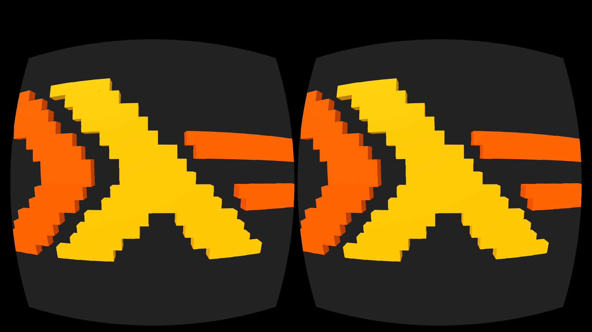

# miso-aframe

Miso bindings for [A-Frame framework](https://aframe.io/) for WebVR.



### Documentation

See Haddock documentation at https://fizruk.github.io/miso-aframe/doc/index.html

### Examples

- "Hello, world!" with basic primitives ([sources](examples/hello-world))
- Animated voxel-based Haskell logo ([sources](examples/haskell-logo-voxels))
- Building a Basic Scene ([sources](examples/guide-basic-scene))

### How to build

```
stack setup
stack build
```

### How to run examples

To run an example use `run-example.sh` script:

```
./repl.sh hello-world
```

When GHCJSi has loaded open your browser and point to
http://localhost:6401/ghcjsiClient.html
(this is a custom REPL page with A-Frame script sources specified).

Now run (or reload) the app using

```
reloadAFrameApp main
```

If you change the sources you can reload affected modules with

```
:reload
```

And reload the app again with `reloadAFrameApp main`.

This script will build everything if needed and also replace `index.html` when necessary.
If build is complete the script will also `open` the example using default browser.
